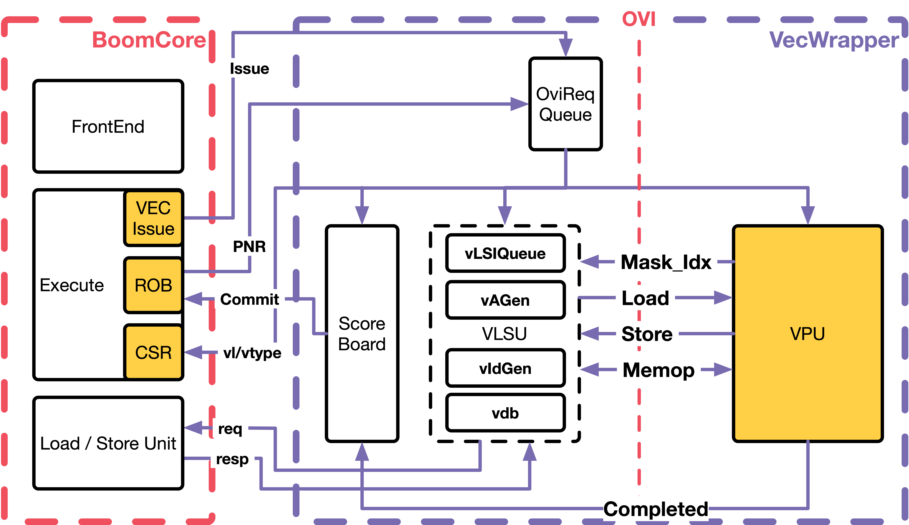
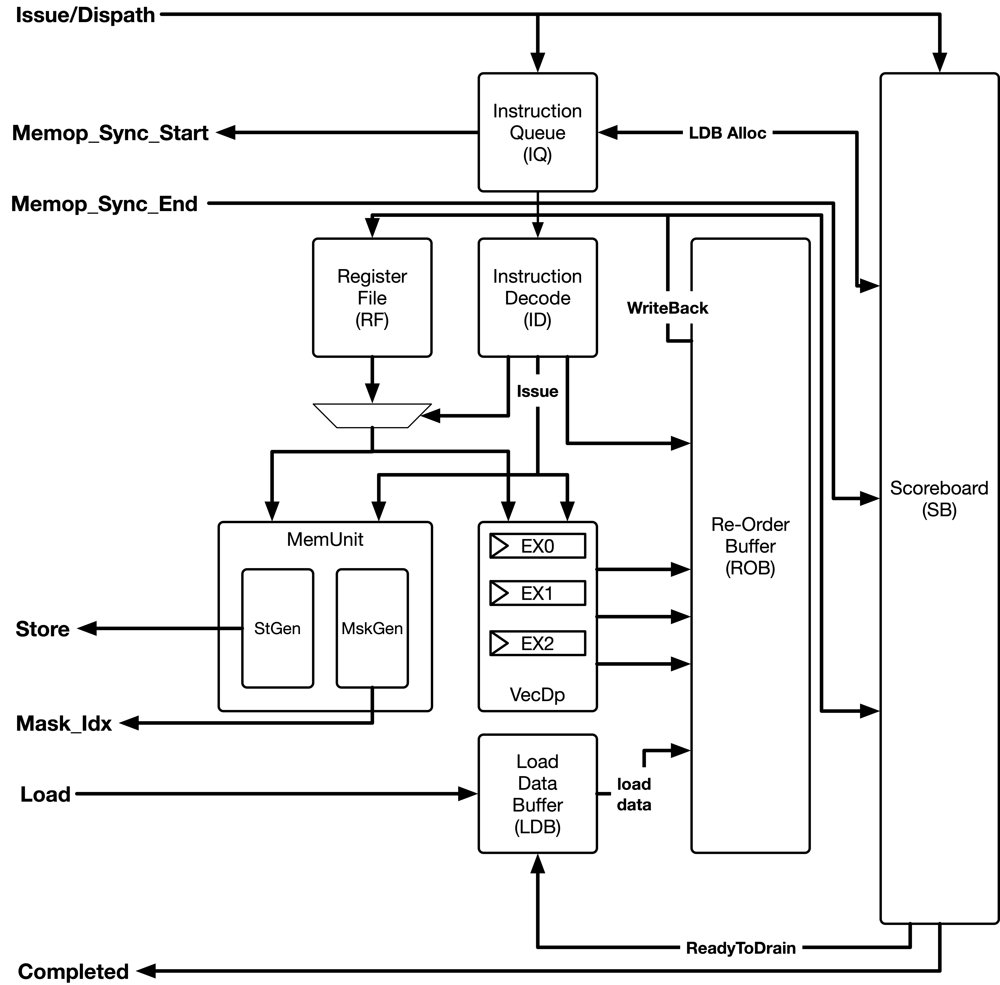
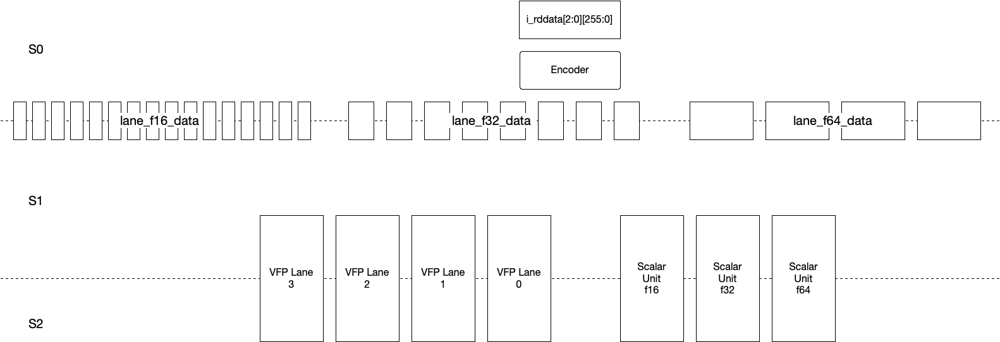
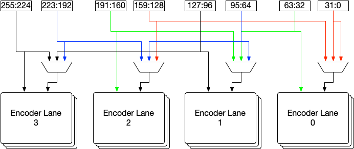
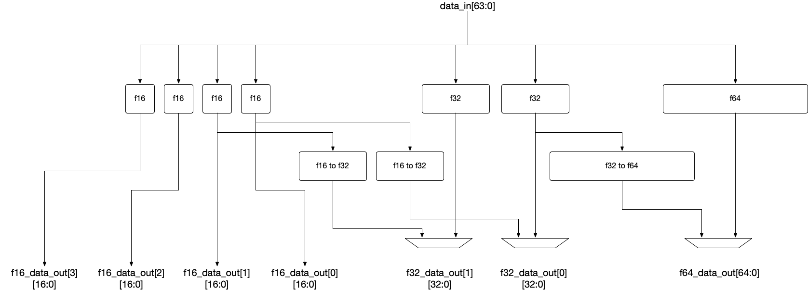
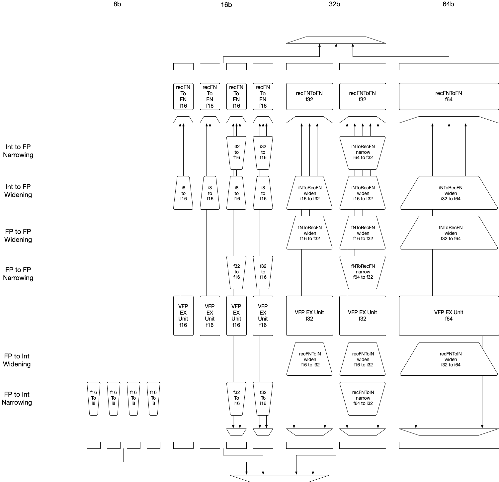
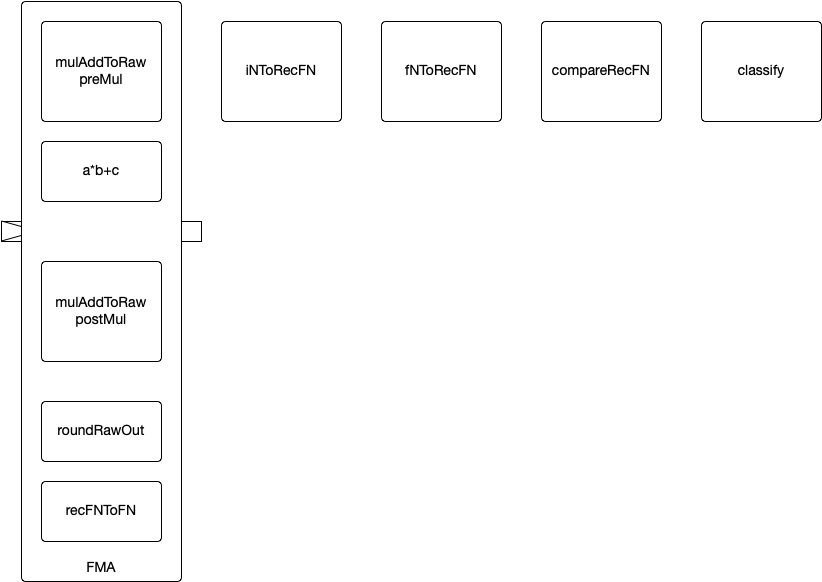
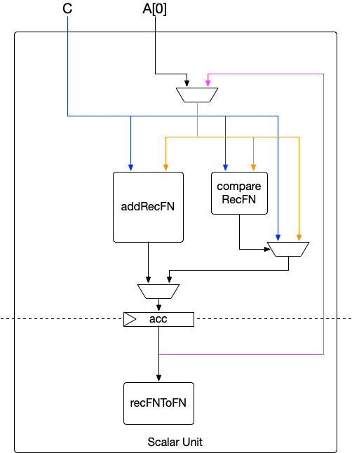

# Vector Extension

## Overview
The added Risc-V Vector (RVV) Unit is based on ratified [Vector Extension 1.0 specification](https://github.com/riscv/riscv-v-spec/releases/tag/v1.0)



The original RVV (RISC-V Vector) unit operates as an in-order pipeline and lacks support for register renaming. It also does not support speculative execution or flushing capabilities. To facilitate integration with the out-of-order Boom core, we have adopted the [Open Vector Interface](https://github.com/semidynamics/OpenVectorInterface), complemented by several microarchitectural (uArch) units that ensure functionality and performance optimization:

- **In-order Vector Issue Queue**: Functioning similarly to other issue queues, it monitors write-back signals from INT/FP/MEM units, activating vector instructions with dependencies on INT/FP registers.

- **Request Queue**: This queue manages vector instructions that have resolved their INT/FP register dependencies. It employs a Point of No Return (PNR) mechanism to halt the process if the oldest vector instruction is speculative.

- **Detached Vector Load/Store Unit**: In alignment with the OVI specifications, the core must generate vector load/store requests. Leveraging this requirement, we have created a fully detached unit to enhance performance, enabling unit-stride and strided loads to be executed out-of-order.

- **Augmented Load/Store Unit**: Modifications to the existing Load/Store Unit (LSU) have been made to handle dependencies between scalar and vector Load/Store requests effectively.

## Limitation & Known issues
1. Doesn't support division, reciprocal, and square root instructions, including
`vdiv, vdivu, vfsqrt, vfsqrt7, vfrec7, vfdiv, vfrdiv, vremu, vrem`
2. The integer unit only supports rounding mode of vxrm==0 (round-to-nearest-up)
3. Doesn't support exceptions on vector instruction.
4. Doesn't support segment load/store (not supported by OVI v1.05)

## Enabling Vector Unit
Vector Unit can be enabled by adding the following line in config-mixins.

For example,
```
class MediumBobcatConfig extends Config(
  new boom.common.WithVector(2) ++
  new boom.common.WithBoomDebugHarness ++                        // Enable debug harness
  new WithCustomBootROM ++                                       // Use custom BootROM to enable COSIM
  new boom.common.WithNMediumBooms(1) ++                          // small boom config
  new chipyard.config.AbstractConfig)
```

## Testing
A few vector test binaries are included in the [Chipyard](https://github.com/tenstorrent/chipyard/tree/bobcat/tests/rvv) repro.

Here's example commands to compile and run a vector test with FSDB generated:
```
export CHIPYARD=<path_to_chipyard>
make -C sims/vcs run-binary-debug-hex CONFIG=SmallBobcatConfig BINARY=$CHIPYARD/tests/rvv/isg/riscv_vector_smoke_test.elf SIM_FLAGS="+cosim"
```
## Slides
[Bobcat Final Presentation](docs/Bobcat_Final_Presentation.pdf)


## Micro-Architecture
### Vector Pipeline

### Vector Floating-Point Unit

### Vector Floating-Point Encoder

### Vector Floating-Point Encoder Lane

### Vector Floating-Point Lane

### Vector Floating-Point Execution Unit

### Vector Floating-Point Scalar Unit
