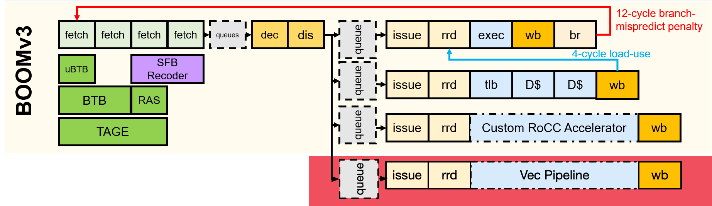
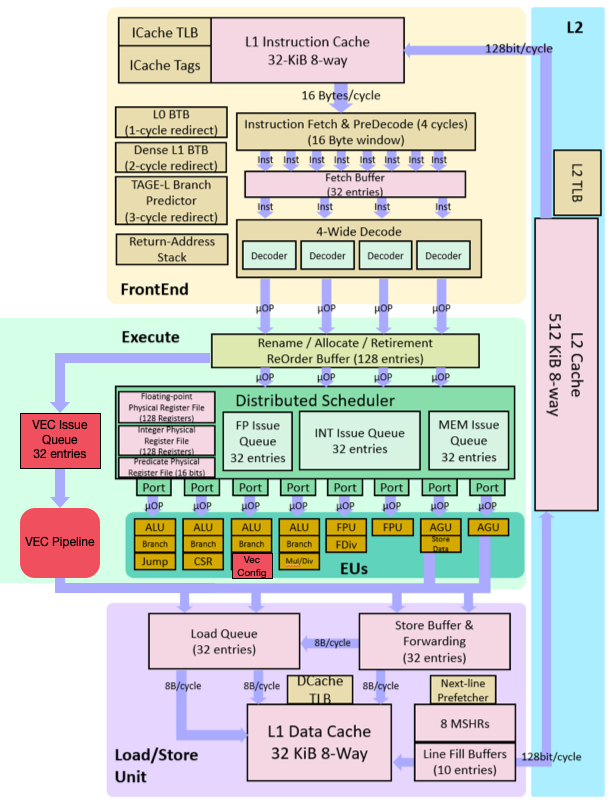

Ocelot: The Berkeley Out-of-Order RISC-V Processor with Vector Support
====================================================================================================================================================================

Ocelot is a project based on the Berkeley Out-of-Order Machine ([BOOM](https://github.com/riscv-boom/riscv-boom)).

It added the support of Risc-V Vector (RVV) Extension [Vector Extension 1.0 specification](https://github.com/riscv/riscv-v-spec/releases/tag/v1.0)

The micro architecture details of the RVV unit can be found at [README-TT.md](/README-TT.md)

Feature | Ocelot
--- | ---
ISA | RISC-V (RV64GCV)
Synthesizable |√
FPGA |√
Parameterized |√
IEEE 754 Floating Point |√
Atomics |√
Caches |√
Virtual Memory |√
Boots Linux |√
Runs SPEC |√
CoreMark/MHz |6.2

## IMPORTANT: Using Ocelot
This repository is **NOT A SELF-RUNNING** repository. To instantiate a Ocelot core, please use the
[Chipyard](https://github.com/tenstorrent/chipyard) SoC generator.

