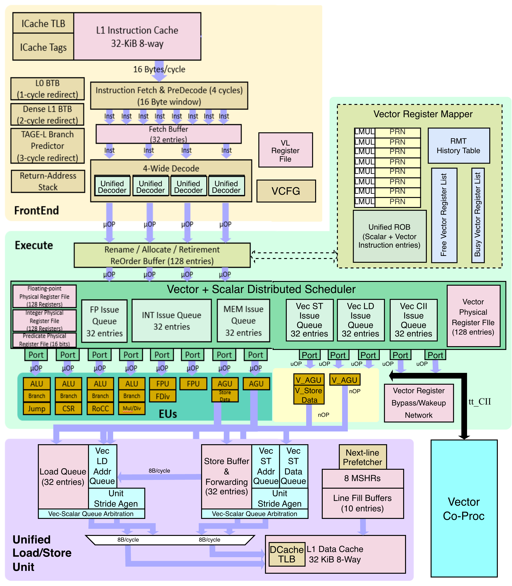
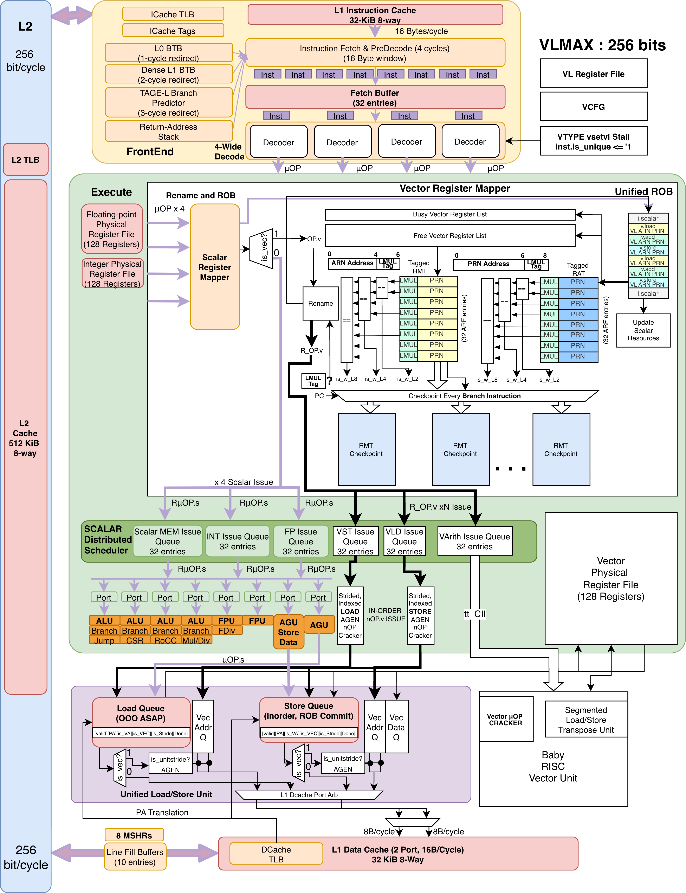
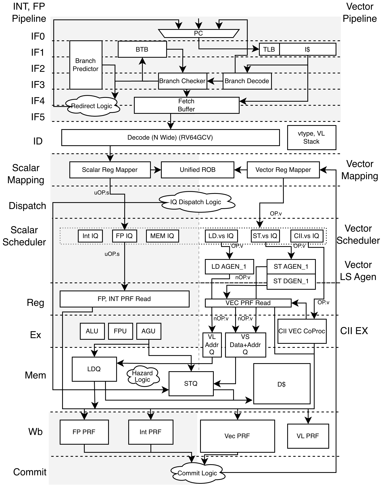
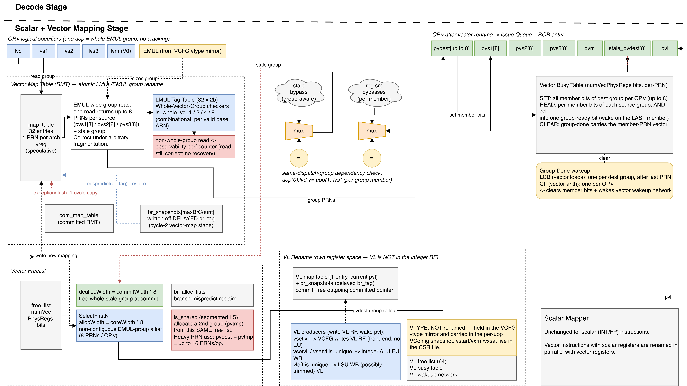
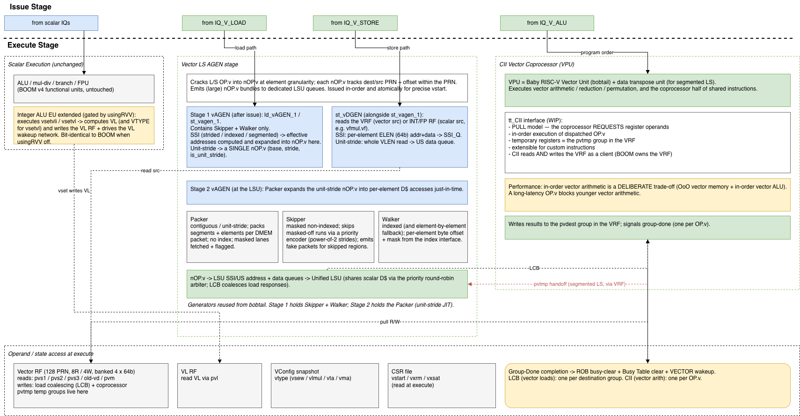

.. Custom attributes — set once, reuse via |name|
.. |caracal| replace:: Caracal
.. |boom| replace:: BOOM
.. |isa| replace:: RV64GC

Block Overview
==============

   Block diagram of Caracal Microarchitecture extended from BOOM.

Core Overview
=============

   Overview of Caracal Microarchitecture.

Pipeline Overview
=================

   The Caracal pipeline, note greyed area are identical to BOOMv4.

Vector Mapper Overview
======================

   Overview of Vector Mapper Stage.

Dispatch Issue Overview
=======================

.. figure:: ../figures/dispatch_issue.png
   :align: center

   Overview of Dispatch and Issue Stages.

Execution Overview
==================

   Overview of Execution Stage.