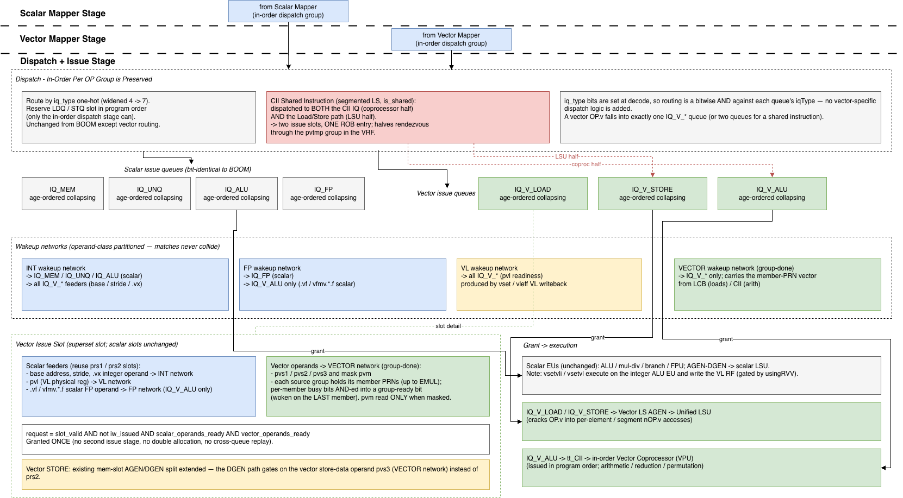

Issue
=====

.. Custom attributes — set once, reuse via |name|
.. |caracal| replace:: Caracal
.. |boom| replace:: BOOM
.. |isa| replace:: RV64GC

   Overview of Dispatch and Issue Stages.

Dispatch Stage
--------------

In |boom|, dispatch is the pipeline stage that sits between rename and the issue queues —
it is the last in-order stage before instructions go out-of-order. This stage routes the
instruction into the appropriate IQ and reserves the LDQ/STQ slot in program order, which
only the in-order dispatch stage can do. The dispatch stage is essentially unchanged from
|boom| except modified to support vector op-codes and routing into the new ``IQ_V_*`` queues.

A special case exists for shared vector instructions.

CII Shared Instruction Scheduling
~~~~~~~~~~~~~~~~~~~~~~~~~~~~~~~~~

Shared instructions (currently only segmented load/store, marked ``is_shared`` by the
Decoder) require more than one execution resource. In the single-stage scheme this is
handled at **dispatch time**: when a segmented load or store is renamed by the vector mapper,
it is dispatched to BOTH the CII IQ/coprocessor and its own Load/Store path. A shared vector
*arithmetic* instruction does not apply — the coprocessor fully manages its own
resources — so shared handling applies only to vector load/store.

The two halves occupy two issue slots but share **one ROB entry**, which stays busy until both
halves report — tracked by the ROB's **1-bit "other half pending" flag** (see the ROB
Completion-tracking section), not a counter. The halves rendezvous on the ``pvtmp`` group in the
VRF (allocated by the vector mapper, see CII Shared Instruction Mapping): the producer writes it as
a destination and the consumer reads it as a source, woken by ``pvtmp``'s group-done on the vector
wakeup network like any vector operand.

The wakeup conditions differ for the two halves:

Segmented Load
^^^^^^^^^^^^^^

1. The LSU treats ``pvtmp`` as its **destination** group and writes the loaded data into it.
2. The LSU is selected for issue when all of its vector source operands are available.
3. ``pvtmp``'s group-done wakes the coprocessor, which reads ``pvtmp``, transposes, and writes
   ``pvdest``.

Segmented Store
^^^^^^^^^^^^^^^

1. The coprocessor treats ``pvtmp`` as its **destination** group and writes the transposed data
   into it.
2. ``pvtmp``'s group-done wakes the store IQ slot.
3. The LSU treats ``pvtmp`` as its **source** group, reads it from the VRF, and writes memory once
   committed.

The Issue/Scheduling Stage
--------------------------

Like |boom|, |caracal| uses split issue queues. The scalar queues — ``IQ_MEM``,
``IQ_UNQ``, ``IQ_ALU``, ``IQ_FP`` — are **unchanged** from |boom|. |caracal| adds three
vector queues: ``IQ_V_LOAD``, ``IQ_V_STORE``, and ``IQ_V_ALU``. Each vector IQ may hold
any datatype.

All queues — scalar and vector — issue in a **single** age-ordered scheduling stage.
|caracal| does **not** add a second issue stage. A vector ``OP.v`` occupies exactly one
issue slot in one queue and is granted **once**, when all of its operands (scalar feeders
and vector registers) are ready. This reuses |boom|'s age-ordered collapsing Issue Queue
and its priority-encoder select unchanged.

Wakeup Networks
~~~~~~~~~~~~~~~

|boom| wires each issue queue only to the wakeup network of its own register space (the
integer queues listen to integer writebacks, the FP queue to FP writebacks). Because each
register space has its own physical-register numbering and its own wakeup ports, operand
matches across spaces never collide. |caracal| preserves this partitioning:

- The scalar queues (``IQ_MEM``/``IQ_UNQ``/``IQ_ALU``/``IQ_FP``) are **bit-identical** to
  |boom| — they connect only to the existing integer/FP wakeup networks.
- **Only the three ``IQ_V_*`` queues connect to the vector wakeup network** (driven by
  **group-done** events — one per completed destination group, each carrying the completing group's
  full member-PRN vector; see :ref:`group-done wakeup <group-done>`). A vector slot matches its
  source members against that vector. Each queue also connects to whichever scalar networks supply
  its scalar feeders:

  - The **integer** network — for the base address, stride, and ``.vx`` scalar operand
    (GPR-sourced). Needed by **all three** vector queues.
  - The **VL** network — for ``pvl`` (its own register space, see :ref:`vl-vtype-rename`).
    Needed by **all three** vector queues. (``vtype`` is not woken — it rides the ``VConfig``
    snapshot.)
  - The **FP** network — for the scalar-FP source of ``.vf`` vector floating-point ops and
    ``vfmv.*.f``. Needed by **``IQ_V_ALU`` only**; ``IQ_V_LOAD``/``IQ_V_STORE`` need no FP
    network because vector memory addressing uses only GPRs.

Vector and scalar operand matches therefore never collide — the same separation |boom|
already relies on for int vs FP — and no pure-scalar slot ever pays for vector match ports.

The Vector Issue Slot
~~~~~~~~~~~~~~~~~~~~~

Only the ``IQ_V_*`` slots are extended; scalar slots are unchanged. A vector slot is a
**superset slot** that tracks both operand classes:

- **Scalar feeders**: the base address, stride, and any ``.vx`` integer operand (reusing the
  existing ``prs1``/``prs2`` operand slots) matched against the **integer** wakeup network, plus
  ``pvl`` matched on the **VL** network (its own register space; ``vtype`` is not an operand —
  it rides the ``VConfig`` snapshot). Vector floating-point ALU ops (``.vf`` forms and
  ``vfmv.*.f``) additionally source one scalar **FP** register, matched against the **FP** wakeup
  network; this applies to ``IQ_V_ALU`` only.
- **Vector operands**, matched against the **vector** wakeup network: ``pvs1``/``pvs2``/
  ``pvs3`` and the mask ``pvm`` (V0). Each source group holds its **member PRNs** (up to ``EMUL``),
  each with its own busy bit; the slot matches every member against the group-done's member-PRN
  vector and **AND**\ s them into a per-operand group-ready bit, woken only when the last member is
  ready (see :ref:`group-done wakeup <group-done>`). This per-member match — not a single
  base comparator — is the area/timing cost of the vector slot, and is unavoidable because a source
  group may be a sub-range of, or fragmented across, larger destination groups.

An ``OP.v`` asserts ``request`` only when **all** of its operands — scalar and vector — are
ready:

.. code-block::

   request := slot_valid && !iw_issued && scalar_operands_ready && vector_operands_ready

For vector **stores** the existing mem-slot AGEN/DGEN split is extended: the
data-generation (DGEN) path is gated on the vector store-data operand ``pvs3`` (matched on
the vector network) rather than on ``prs2`` as in the scalar mem slot.

The mask ``pvm`` is read conditionally — its busy bit only participates in ``request`` when
the OP.v is masked (encoded ``vm`` bit clear). Unmasked ops leave ``pvm`` don't-care so a
stale mask preg is never waited on.

VL delivery
-----------

VL is a source operand in its **own register space** (see :ref:`vl-vtype-rename`), always renamed
into the VL RF — there is no decode-time VL value. ``pvl`` is woken on the **VL** wakeup network like
any operand — a plain readiness wakeup, no value capture in the slot — and the value is read from the
VL RF at execute, when the Vector AGEN cracks the ``OP.v`` into element accesses. (``vtype`` is not
an issue operand — it rides the ``VConfig`` snapshot from decode.)

- **vsetivli**: VL is immediate — the VCFG writes the VL RF in the front-end (no EU); ``pvl`` may
  already be ready when the consumer dispatches.
- **vsetvli / vsetvl**: executed on an **integer ALU EU** (woken by ``rs1``/``rs2`` on the integer
  network); the ALU's VL writeback targets the VL RF and wakes ``pvl``. ``vsetvl`` is additionally
  ``is_unique`` (see :ref:`vector-rvv-decode`).

Single-Stage Scheduling Key Features
------------------------------------

The single-stage approach with extended vector slots offers the following benefits:

1. **The scalar datapath is untouched.** Only the ``IQ_V_*`` queues are extended and connect
   to the vector wakeup network; the scalar queues are bit-identical to |boom|.
2. **VL is an ordinary integer operand** — woken like any scalar feeder and read from the integer
   RF/bypass by the vector EU at execute.
3. **A vector ``OP.v`` is allocated and selected once.** There is no second issue stage, so
   there is no double allocation, no second priority-encoder select, and no cross-queue
   kill/replay to keep consistent.
4. **Enables a detached CII co-processor**, with temporary registers and shared instructions
   dispatched at grant time.
5. **Cracking of vector instructions in the frontend is unnecessary**, made possible by the
   atomic LMUL vector mapper and AGEN-time element cracking.
